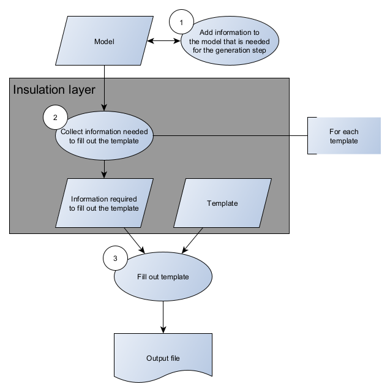
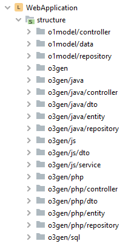
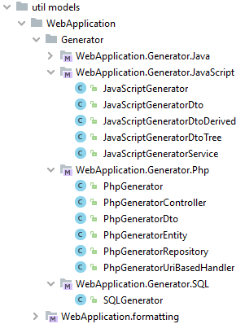
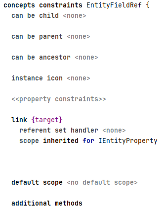
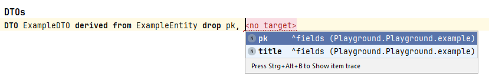

# Explanation

Information that should help you gain a deeper understanding.

## Design decisions

### Using an insulation layer for the generation step

I tried to insulate the *generation step* from the model.

For every template there is corresponding structure. This structure contains all the information needed to fill the template.

The template is filled out with information from this structure. The model is not accessed while filling out a template.

This has several advantages:

1. There is hardly any logic in the templates.
2. If the model changes, then it does not affect the templates.
3. While collecting and assembling the information you have access to the full model.

### Using com.dslfoundry.plaintextgen to generate source code

I am using the plaintextgen plugin to generate source code.

I am even using it when generating Java code, instead of the "native" way of generating Java.

My goal was to get people started without diving too deep into MPS. In my opinion, the "native" way requires a lot of effort to get used to it.

### Structuring the concepts

* o1model: The concepts used in the model
* o3gen: The concepts used for the generation step. Each target language has its own concepts.

### Utility classes

Preparing data for the generation step is done by utility classes.

### PHP REST endpoints

The server-side PHP REST endpoints are implemented via index.php files. No framework is used.

In an intermediate step, I collect all endpoints and the methods at each endpoint.

The result is called UriBasedHandler.

### Aspects used

The following aspects were used:

* Editor
* Constraints

This is used in DtoDerived to make sure, that in the list "drop" you can only select a field of the current entity.

* Validations
* BaseLanguage, e.g. for the utility classes
* Generator

### Documentation links

[Readme](../readme.md)  | [Tutorial](Tutorial.md)  |  [How to..](HowTo.md) | [Reference](Reference.md)
