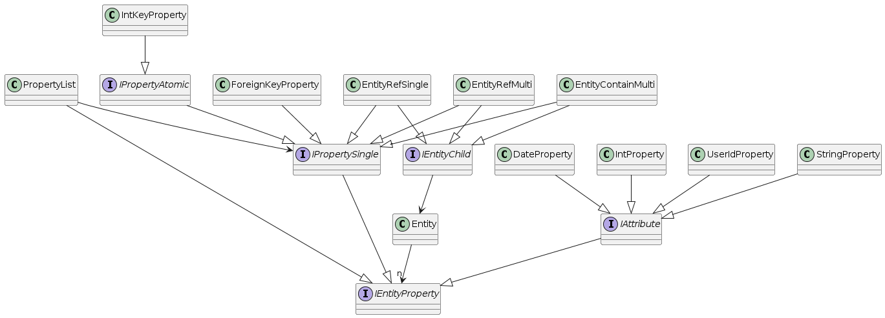

# Reference

## Class diagram

### Class hierarchy for the Entity

Please refer to the source code for more information.

## Definitions (Glossary)

Words used in this project and their meaning.

The definitions are not exhaustive.

| Term      | Definition |
| --------  | -------- |
| DTO       | Data transfer object. A class that is used to transfer information between the frontend and the backend. |
| Entity    | Stores business objects. |
| Fragment  | A file that is included in another file. |
| Generator | Uses the information stored in the model to generate new information. This might be a modified model, or (text) output, via a template. |
| Model     | A model in MPS. |
| Prompt    | A text that is sent to a chat application to generate source code. This feature is currently not used. |
| Template  | I like to use the analogy of "mail merge" or "serial mail". |

## Links

I have taken inspiration from the following sources

[Divio Documentation System](https://docs.divio.com/documentation-system/) : A good way to structure documentation.

[Spring Boot, Spring Data JPA – Rest CRUD API example](https://www.bezkoder.com/spring-boot-jpa-crud-rest-api/) : I've implemented the Java / SpringBoot server part similar to the code presented in the tutorial.

[Jason Watmore: Angular 15/16 Free Course](https://jasonwatmore.com/angular-15-free-course-1-create-base-project-structure)  : I am using the login / register mechanisms from the course. You should definitely take a look at the course.

## Tools

[Angular CLI](https://github.com/angular/angular-cli) : Set up an Angular project

[GPTGenerator](https://github.com/janradeck/gptgenerator) : The primary use is to merge source files.

### Documentation links

[Readme](../readme.md)  | [Tutorial](Tutorial.md)  |  [How to..](HowTo.md) | [Explanation](Explanation.md)
