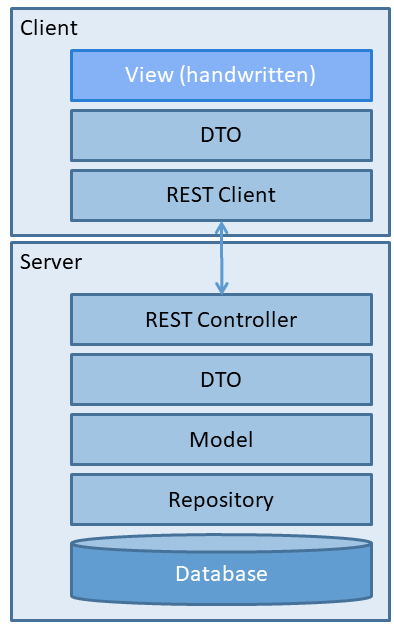
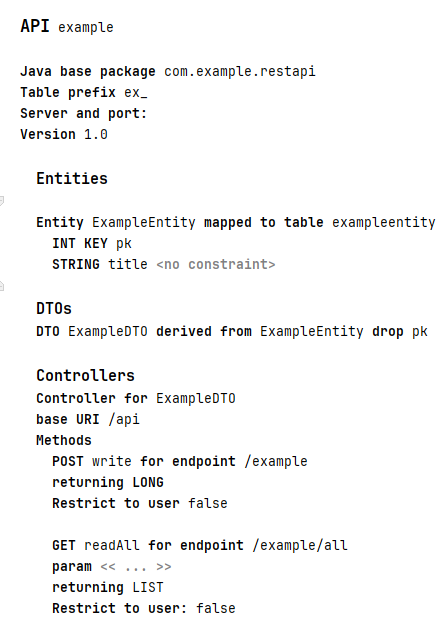
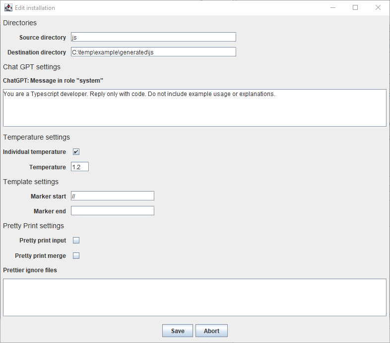
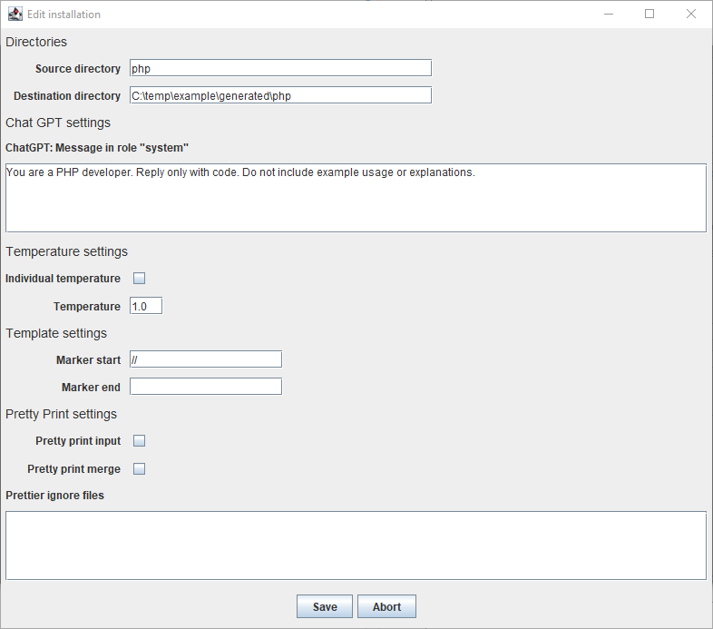
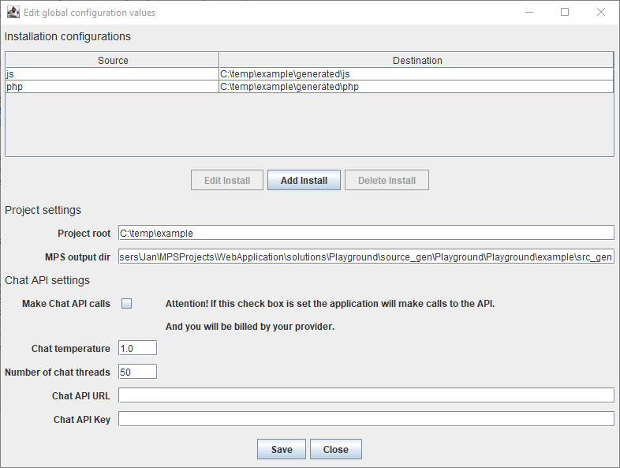
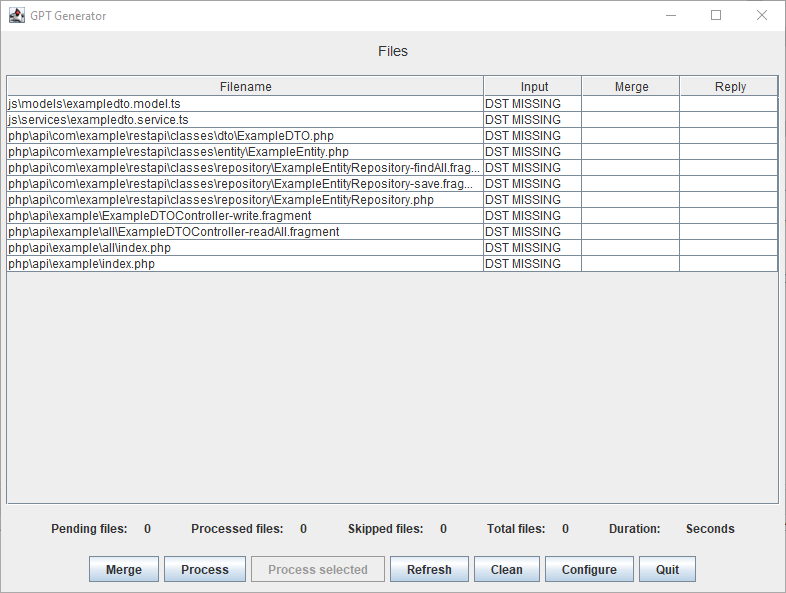
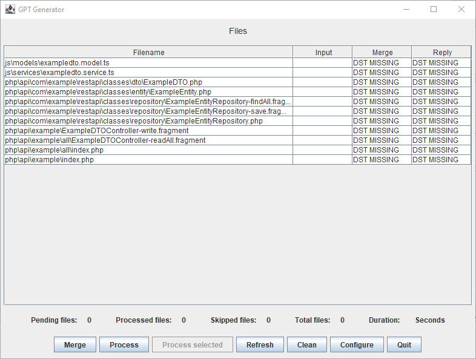

# Tutorial

## Create your first application

### Overview

A simplified view of the layers of the application.



### Goal

You will be generating code for a web application that uses a REST API to communicate with the server.

### What you will need to know

* You need to be able to create and edit models in JetBrains MPS and to regenerate models.
* You should have a basic understanding of Angular JS

### Steps

1. Set up prerequisites
2. Create your model
3. Generate the code
4. Write custom code

### Set up prerequisites

#### Required tools

* JetBrains MPS with the plugin *com.dslfoundry.plaintextgen* installed
* A working *Angular JS environment*, to compile the Angular code. I used *Angular CLI*
* A working copy of *GPTGenerator* (see Reference). It is used to merge generated files.
* The project "WebApplication" opened in MPS

#### Required infrastructure

* A web server where you can execute PHP scripts.
* A MySQL/MariaDB database. You should be able to create databases and tables.
* A directory for the generated source code. In this example I am using "C:\temp\example"

### Create your model

* Create a new instance of "API"

  * Go to the sandbox "Playground" and create a new instance of "API".
  * Set the name to "example".
  * Set "Java base package" to "com.example.restapi"
  * Set "Table prefix" to "ex_"
  * Enter a blank into "Server and port"
  * Set Version to "1.0"
  The screen should look like this:

* Create your entity
  * Go to the section "Entities" and press "Enter". A new instance of "Entity" should appear.
  * Give the entity the name "ExampleEntity" and map it to the table "exampleentity"
  * Move the cursor to the input below the entity, press &lt;Ctrl&gt;-&lt;Space&gt; and select "INTKEY" from the completion menu. Give the key the name "pk"
  * Press &lt;Enter&gt;, create a new "STRING" and give it the name "title"

* Create your DTO
  * Go to the section "DTO", press &lt;Enter&gt; to create a new instance, and select "DTO Derived" from the completion menu.
  * Set the name to "ExampleDTO", select "ExampleEntity" as the value for "from" and add the field "pk" to the list for "drop"
  * The result should look like this

* Create your controller
  * Go to the section "Controllers" and press &lt;Enter&gt;
  * Select the DTO "ExampleDTO"
  * Set "base URI" to "/api"

* Create a POST method
  * Select "ControllerMethodPOST" from the completion menu
  * Set the name to "write" and the endpoint to "/example"
* Create a GET method
  * Select "ControllerMethodGET" from the completion menu
  * Set the name to "readAll" and the endpoint to "/example/all"
  * Change the value of "returning" from "SCALAR" to "LIST"

The resulting model should look like this in the editor:



### Generate the code

Select the solution "Playground" and call "Rebuild solution Playground".

### Take a look at the generated source code

The generated source code is located under

``` Shell
WebApplication/solutions/Playground/source_gen/Playground/Playground/example
```

#### DDL to create the table

The file 'CreateStatement_Example.sql' contains the SQL statements to create the table.

You can see that the generated table name has the prefix "ex_" that we configured.

``` SQL
 DROP TABLE IF EXISTS ex_exampleentity;
 CREATE TABLE ex_exampleentity (
  pk int NOT NULL AUTO_INCREMENT,
  title varchar(255) ,
 PRIMARY KEY(pk)
 );
```

### Configure and call GPTGenerator

The source files created during generation need to be merged.

Start GPTGenerator and open the configuration dialogue.

Add settings for JavaScript:



Add settings for PHP:



The configuration dialogue should look like this:



Be sure to change the value of "MPS output dir"!

In my case it has the value

``` Shell
C:\Users\Jan\MPSProjects\WebApplication\solutions\Playground\source_gen\Playground\Playground\example\src_gen
```

Close the application and start it again. The main screen should look like this:



Press the button *Process*. This should take a second or two. Now the main screen should look like this:



Let's take a look at the generated source code.

#### The generated directory structure

``` Shell
js/
  models/
    exampledto.model.ts
  services/
    exampledto.service.ts
php/
  api/
    com/
      example/
        restapi/
          classes/
            dto/
              ExampleDTO.php
            entity/
              ExampleEntity.php
            repository/
              ExampleEntityRepository.php
    example/
      index.php
      all/
        index.php
```

#### JavaScript DTO

In the directory "C:\temp\example\generated\js\models", the file "exampledto.model.ts"

``` JavaScript
import { MySQLFormatService } from '../../services/mysqlformat.service';
export class ExampleDTO {
       private _title: string;

   constructor(title : string) {
         this._title = title;
   }

       public get title(): string {
           return this._title;
       }

       public set title(title : string) {
           this._title = title;
       }

   
       public toJSON() {
         return { title : this._title }
   }
}
```

#### Java Script controller

In the directory "C:\temp\example\generated\js\services", the file "exampledto.service.ts":

``` JavaScript
import { Injectable } from '@angular/core';
import { HttpClient } from '@angular/common/http';
import { Observable } from 'rxjs';
import { ExampleDTO } from "../models/exampledto.model";

@Injectable({
  providedIn: 'root'
})
export class ExampleDTOService {
  private apiUrl = '/api';

  constructor(private http: HttpClient) { }

  readAll(): Observable<ExampleDTO[]> {
    const endpoint = `${this.apiUrl}/example/all/`;
    return this.http.get<ExampleDTO[]>(endpoint);
  }
  write(): Observable<Object> {
    const endpoint = `${this.apiUrl}/example/`;
    return this.http.post(endpoint, payload);
  }

}
```

### PHP controller code for the POST method

In the directory "C:\temp\example\generated\php\api\example" the file "index.php":

``` PHP
<?php
$RELATIVE_PATH= '../..';
$ABS_PACKAGE_DIR = $RELATIVE_PATH.'/com/example/restapi';
require_once $RELATIVE_PATH.'/rbc/config.php';
require_once $ABS_PACKAGE_DIR.'/classes/service/TokenService.php';
require_once $ABS_PACKAGE_DIR.'/classes/entity/JWTToken.php';
    require_once $ABS_PACKAGE_DIR.'/classes/repository/ExampleEntityRepository.php';
    require_once $ABS_PACKAGE_DIR.'/classes/dto/ExampleDTO.php';


header('Content-Type: application/json');

$method = $_SERVER['REQUEST_METHOD'];
switch ($method) {
// Handling preflight requests
  case 'OPTIONS':
    break;


 case 'POST':
  $assoc = json_decode(file_get_contents('php://input'), true);

  $rootDto = ExampleDTO::newFromAssoc($assoc['ExampleEntity']);
  $rootId = ExampleEntityRepository::save($rootDto->asExampleEntity());
  http_response_code(200);
  break;

 default:
 http_response_code(405);
 echo json_encode(['error' => 'Method not allowed']);
 break;
}
?>
```

### PHP controller code for the GET method

In the directory "C:\temp\example\generated\php\api\example\all" the file "index.php":

``` PHP
<?php
$RELATIVE_PATH= '../../..';
$ABS_PACKAGE_DIR = $RELATIVE_PATH.'/com/example/restapi';
require_once $RELATIVE_PATH.'/rbc/config.php';
require_once $ABS_PACKAGE_DIR.'/classes/service/TokenService.php';
require_once $ABS_PACKAGE_DIR.'/classes/entity/JWTToken.php';
    require_once $ABS_PACKAGE_DIR.'/classes/repository/ExampleEntityRepository.php';
    require_once $ABS_PACKAGE_DIR.'/classes/dto/ExampleDTO.php';


header('Content-Type: application/json');

$method = $_SERVER['REQUEST_METHOD'];
switch ($method) {
// Handling preflight requests
  case 'OPTIONS':
    break;


 case 'GET':
 

 $result = [];

 foreach (ExampleEntityRepository::findAll() as $entity) {
  $result[] = ExampleDTO::newFromEntity($entity);
 }
 echo json_encode($result);
 break;

 default:
 http_response_code(405);
 echo json_encode(['error' => 'Method not allowed']);
 break;
}
?>

```

### Write custom code

Currently the user interface code is written entirely by hand.

Here is the source code of the robot configuration wizard, robotconfigurator.component.ts:

``` JavaScript
import { Component, OnInit, ViewChild } from '@angular/core';
import { MatStepper } from '@angular/material/stepper';
import { HttpClient } from '@angular/common/http';
import { MatSnackBar } from '@angular/material/snack-bar';

import { RobotBrandGetDTO } from '../../generated/models/robotbrandgetdto.model';
import { RobotModelGetDTO } from '../../generated/models/robotmodelgetdto.model';
import { ModelVariantGetDTO } from '../../generated/models/modelvariantgetdto.model';
import { AddOnGetDTO } from '../../generated/models/addongetdto.model';
import { AddOnSaveDTO } from '../../generated/models/addonsavedto.model';
import { RobotConfigSaveDTO } from '../../generated/models/robotconfigsavedto.model';
import { RobotConfigFullSaveDTO } from '../../generated/models/robotconfigfullsavedto.model';
import { RobotBrandGetDTOService } from '../../generated/services/robotbrandgetdto.service';
import { RobotModelGetDTOService } from '../../generated/services/robotmodelgetdto.service';
import { ModelVariantGetDTOService } from '../../generated/services/modelvariantgetdto.service';
import { AddOnGetDTOService } from '../../generated/services/addongetdto.service';
import { RobotConfigFullSaveDTOService } from '../../generated/services/robotconfigfullsavedto.service';

@Component({
  selector: 'app-robotconfigurator',
  templateUrl: './robotconfigurator.component.html',
  styleUrls: ['./robotconfigurator.component.css'],
})
export class RobotConfiguratorComponent implements OnInit {
@ViewChild('stepper', { static: true }) stepper!: MatStepper;	
  configuration: RobotConfigSaveDTO = new RobotConfigSaveDTO ('', new Date, -1, -1, -1);
  brands: RobotBrandGetDTO[]= [];
  models: RobotModelGetDTO[]= [];
  variants: ModelVariantGetDTO[]= [];
  addOns: AddOnGetDTO[] = [];
  selectedBrand: string = '';
  selectedModel: string = '';
  selectedVariant: string = '';
  selectedAddOns: AddOnGetDTO[] = [];
  variantPrice = 0;
  totalPrice = 0;

  constructor(
    private robotBrandService: RobotBrandGetDTOService,
    private robotModelService: RobotModelGetDTOService,
    private modelVariantService: ModelVariantGetDTOService,
	private addOnService: AddOnGetDTOService,
    private robotConfigSaveService: RobotConfigFullSaveDTOService,
	private snackBar: MatSnackBar	
	
  ) {
  }

  ngOnInit() {
    this.stepper.selectedIndex = 0;	
    this.loadRobotBrands();
	console.log('ngOnInit RobotConfigurator');
  }

  private loadRobotBrands() {
	console.log('loadRobotBrands RobotConfigurator');
    this.robotBrandService.getRobotBrandsAll().subscribe({
	  next: (data: RobotBrandGetDTO[]) => {
      this.brands = data; },
		error: (e) => console.error(e)
        });
  }

  selectBrand(brand: RobotBrandGetDTO) {
    this.configuration.brand = brand.id;
	this.selectedBrand = brand.name;
	this.selectedModel = '';
	this.selectedVariant = '';
	this.selectedAddOns = [];	
	this.configuration.configurationname = '';
    this.loadRobotModels();
  }

  private loadRobotModels() {
    this.robotModelService
      .getRobotModelsByBrand(this.configuration.brand)
      .subscribe((models: RobotModelGetDTO[]) => {
        this.models = models;
        this.stepper.selectedIndex = 1;
      });
  }

  selectModel(model: RobotModelGetDTO) {
    this.configuration.model = model.id;
	this.selectedModel = model.name;
	this.selectedVariant = '';
	this.selectedAddOns = [];
	this.configuration.configurationname = '';
    this.loadModelVariants();
  }

  private loadModelVariants() {
    this.modelVariantService
      .getVariantsForModel(this.configuration.model)
      .subscribe((variants: ModelVariantGetDTO[]) => {
        this.variants = variants;
        this.stepper.selectedIndex = 2;
      });
  }

  selectVariant(variant: ModelVariantGetDTO) {
    this.configuration.variant = variant.id;
	this.selectedVariant = variant.name;
	this.selectedAddOns = [];
	this.configuration.configurationname = '';
	this.variantPrice = variant.price;
	this.totalPrice = this.variantPrice;
	this.loadAddons();
  }

  private loadAddons() {
    this.addOnService
      .getAddonsForVariant(this.configuration.variant)
      .subscribe((addOns: AddOnGetDTO[]) => {
        this.addOns = addOns;
        this.stepper.selectedIndex = 3;
      });
  }
  
  toggleAddOnSelection(addOn: AddOnGetDTO) {
    const index = this.selectedAddOns.indexOf(addOn);
    if (index === -1) {
      this.selectedAddOns.push(addOn);
    } else {
      this.selectedAddOns.splice(index, 1);
    }
	this.updatePrice();
  }  
  
  updatePrice() {
	this.totalPrice = this.variantPrice;
	for (const selectedAddOn of this.selectedAddOns) {
		this.totalPrice = this.totalPrice + selectedAddOn.price;
	}	  
  }

  isSelectedAddOn(addOn: AddOnGetDTO): boolean {
    return this.selectedAddOns.some((selected) => selected.id === addOn.id);
  }  

 continueToSaveConfiguration() {
	this.configuration.configurationname = this.selectedBrand + " " + this.selectedModel + " " + this.selectedVariant;
    this.stepper.selectedIndex = 4;
  }  
  
  saveConfiguration() {
    this.configuration.configurationdate = new Date();
	let addonSaveDto : AddOnSaveDTO[] = [];
	for (const selectedAddOn of this.selectedAddOns) {
	  // Creating a new AddOnSaveDTO for each element
	  const newAddOnSaveDTO = new AddOnSaveDTO(selectedAddOn.id);

	  // Adding the new element to the addOns list
	  addonSaveDto.push(newAddOnSaveDTO);
	}
	
	let saveDto: RobotConfigFullSaveDTO = new RobotConfigFullSaveDTO(this.configuration, addonSaveDto);
    this.robotConfigSaveService.save(saveDto).subscribe(
      (result) => {
        // Handle successful save
        this.stepper.selectedIndex = 5;		
        console.log('Configuration saved successfully:', result);
      },
      (error) => {
        // Handle error
        console.error('Error saving configuration:', error);
      }
    );
  }
  
  restart() {
    this.stepper.selectedIndex = 0;		  
    this.selectedBrand = '';
	this.selectedModel = '';
	this.selectedVariant = '';
	this.selectedAddOns = [];
	this.configuration.configurationname = '';	
  }
}
```

The source code for the HTML:

``` HTML
<!-- robotconfigurator.component.html -->
<div>
<h2>Welcome to the Robot Configurator</h2>
</div>

<mat-vertical-stepper [linear]="true" #stepper>
  <!-- First Page -->

  <mat-step label="Select brand">
    <ng-template cdkStepLabel>Select Brand</ng-template>
	<table>
	<tbody>
		<tr *ngFor="let brand of brands">
	  <td class="logo"></td>
	  <td class="pad calign">
	  <div class="brand-name">{{ brand.name }}</div>
	  <div class="brand-slogan">{{ brand.slogan }}</div>
	  </td>
	  </tr>
	  </tbody>
	</table>
  </mat-step>

  <mat-step label="Select model">
    <ng-template cdkStepLabel>Select Model</ng-template>
	<div>{{this.selectedBrand}}</div>
	<div>&nbsp;</div>
    <div *ngIf="models">
	<table>
	<tbody>
	<tr *ngFor="let model of models">
		<td>
		<td class="logo"></td>
        <td class="pad">{{ model.name }}</td>
	<td class="pad">{{ model.description }}</td>
	</tr>
	</tbody>
	</table>
	
	</div>
  </mat-step>

  <mat-step label="Select variant">
    <ng-template cdkStepLabel>Select Variant</ng-template>
	<div>{{this.selectedBrand}} | {{this.selectedModel}} </div>
	<div>
	
	</div>
	<div>&nbsp;</div>
    <div *ngIf="variants">
	<table>
	<thead>
	<tr>
	<th></th>
	<th class="pad">Variant</th>
	<th class="ralign pad">Base price</th>
	</tr>
	</thead>
	<tbody>
	<tr *ngFor="let variant of variants">
	<td>
      <button
		(click)="selectVariant(variant)">
        Select
      </button>
	  </td>
	  <td class="pad">{{ variant.name }}</td>
	  <td class="pad ralign">{{ variant.price }} EUR</td>
	  </tr>
	  </tbody>
	</table>
	    </div>
  </mat-step>

  <mat-step label="Select add-on">
    <ng-template cdkStepLabel>Select AddOn</ng-template>
	<div>{{this.selectedBrand}} | {{this.selectedModel}} | {{this.selectedVariant}}</div>
	<div>
	
	</div>	
	<div>&nbsp;</div>
    <div *ngIf="addOns">
	<table>
	<thead>
	<tr>
	<th></th>
	<th class="pad">Add-On</th>
	<th class="pad">Description</th>
	<th class="pad ralign">Add-On price</th>
	</tr>
	</thead>	
	<tbody>
	<tr *ngFor="let addOn of addOns">
	<td>
<label>
        <input
          type="checkbox"
          [checked]="isSelectedAddOn(addOn)"
          (change)="toggleAddOnSelection(addOn)"
        />
          </label>
	  </td>
	  <td class="pad">
	  {{ addOn.name }}
	  </td>
	  <td class="pad">{{ addOn.description }}</td>
	  <td class="ralign">{{ addOn.price }}</td>
	  <td>EUR</td>
	  </tr>
  	  <tr>
	  <td></td>
	  <td class="vpad pad lalign pvariant" colspan="2">Base price</td>
	  <td class="vpad ralign pvariant">{{ this.variantPrice }}</td>
	  <td class="pvariant">EUR</td>
	  </tr>

	  <tr>
	  <td></td>
	  <td class="pad lalign psum" colspan="2">Total price</td>
	  <td class="ralign psum">{{ this.totalPrice }}</td>
	  <td class="psum">EUR</td>
	  </tr>
	  </tbody>
	  </table>
	    </div>
      <button (click)="continueToSaveConfiguration()">Continue</button>
  </mat-step>
  <mat-step label="Save">
    <ng-template cdkStepLabel>Save Configuration</ng-template>
<table>
		<tr class="table-row">
			<td>Brand:</td>
			<td>{{this.selectedBrand}}</td>
		</tr>
		<tr class="table-row">
			<td>Model:</td>
			<td>{{this.selectedModel}}</td>
		</tr>
		<tr>
			<td>Variant:</td>
			<td>{{this.selectedVariant}}</td>
		</tr>
		<tr>
			<td>AddOns:</td>
			<td>
			<ul>
				<div *ngFor="let addOn of this.selectedAddOns">
				<li>{{ addOn.name }}</li>
				</div>
			</ul>
			</td>
		</tr>
		<tr>
		<td>Configuration name:</td>
		<td>      <input
        id="configName"
        type="text"
		size="50"
        [(ngModel)]="configuration.configurationname"
		/>
</td>
		</tr>
		
	</table>	
	<div>&nbsp;</div>
    <div>
      <label for="configName">&nbsp;</label>
      <button
        [disabled]="configuration.configurationname.length <= 2"
        (click)="saveConfiguration()"
      >
        Save
      </button>
    </div>
  </mat-step>
  <mat-step label="Summary">
    <ng-template cdkStepLabel>Save success</ng-template>
	<h3>Configuration saved successfully!</h3>
	<table>
		<tr class="table-intro" >
			<td>Configuration:</td>
			<td>{{ this.configuration.configurationname }}</td>
		</tr>
		<tr class="table-row">
			<td>Brand:</td>
			<td>{{this.selectedBrand}}</td>
		</tr>
		<tr class="table-row">
			<td>Model:</td>
			<td>{{this.selectedModel}}</td>
		</tr>
		<tr>
			<td>Variant:</td>
			<td>{{this.selectedVariant}}</td>
		</tr>
		<tr>
			<td>AddOns:</td>
			<td>
			<ul>
				<div *ngFor="let addOn of this.selectedAddOns">
				<li>{{ addOn.name }}</li>
				</div>
			</ul>
			</td>
		</tr>		
	</table>
	<div>&nbsp;</div>
    <div>
      <button
        (click)="restart()"
      >
        Back
      </button>
    </div>
  </mat-step>
  
</mat-vertical-stepper>

```

### Documentation links

[Readme](../readme.md)  |  [How to..](HowTo.md) |  [What is..](Explanation.md) | [Reference](Reference.md)
