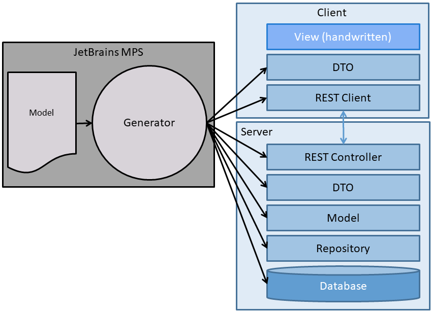

# WebApplication

A JetBrains MPS project to generate a persistence layer and a REST API as a basis for a web application in Angular.

It was built to show how you can get started using JetBrains MPS.

## Overview

The following diagram shows the simplified workflow.

Want to try it yourself? Then the [tutorial](doc/Tutorial.md) is the place to start.

## What does it do?

* You are able to model entities, DTOs as well as controllers and their methods.
* From the model the source code for JavaScript (user interface) and Java / PHP (server side) can be generated. The generated code implements a persistence layer.

## Why?

* The chosen domain should be fairly familiar to a lot of developers.
* You should be get the benefit without diving too deep into JetBrains MPS.
* You should be able to extend the project, and reaping greater benefit, without diving too deep into JetBrains MPS.
* There are a lot of solutions available. This one can be customized to a very large degree. And by using a generator, you can switch programming languages and target platform easily.

## Example application

I have built a simple example application that can be found at [Robot configurator](https://robotconfig.janradeck.de/)

The application uses a simplified user management. You can create a new login by selecting "Register".

It is a simple wizard to configure a robot with the following steps:

1. Select manufacturer
2. Select make
3. Select model
4. Select variant
5. Select a number of add-ons
6. Save configuration

Then you can go to the list of configurations and display the detailed configuration.

Create a login and check it out!

**Attention**: This is a demo application. Many aspects are **not** fit for production.
Therefore I will not publish the (non-generated) source for the supporting code, like authentication.

## To be done

Things that need to be done:

* Tests
* Integrate the validation methods of the DTOs in the user interface
* Integrate GPTGenerator into the build mechanism. This will require a "deep dive" into MPS.

### Documentation links

The structure of the documentation was inspired by the [Divio Documentation System](https://docs.divio.com/documentation-system/)

[How to...](doc/HowTo.md)  |  [What is..](doc/Explanation.md)  |  [Reference](doc/Reference.md)
